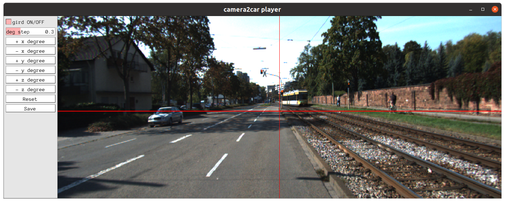

# Introduction
Camera2car pose calibration via vanishing point and horizon line detection. Both automatic and manual calibration approaches are provided.

## Automatic calibration
We design a network to predict vanishing point and horizon line on a single image. The code is based on the implementations of [**CTRL-C: Camera calibration TRansformer with Line-Classification**](https://github.com/jwlee-vcl/CTRL-C). 

### Demo


https://user-images.githubusercontent.com/91944792/210723034-4c92dcca-1c80-4577-8c7e-9d34d3544bb7.mp4


### Setup Environment
  ```
  conda create -n ctrlc
  conda activate ctrlc
  conda install -c pytorch torchvision

  pip install -r requirements.txt
  ```
### Dataset
We annotated vanishing point and horizon line on KITTI dataset for training. Please download it from the link below.
```
Link(链接): https://pan.baidu.com/s/1iKXnzFZzQ6RvqCal2GzNOQ
Extraction code(提取码): 89sf 
```

### Train
* Single GPU

```shell
python train.py --config-file config-files/ctrlc.yaml
```

* Multi GPU

```shell
python -m torch.distributed.launch --nproc_per_node=4 --use_env train.py --config-file config-files/ctrlc.yaml
```
### Pre-trained Model
Download the pre-trained model from [Google Drive](https://drive.google.com/file/d/1yuYZ85pFMVD4tHdw07ZSVHz__ecI58fV/view?usp=share_link).

### Evaluation
* kitti dataset
```
python test_kitti.py --config-file config-files/ctrlc.yaml --opts MODE test
```
* single image inference
```
python test_img.py --config-file config-files/ctrlc.yaml --opts MODE test DATASET_DIR ./pic/ OUTPUT_DIR ./outputs/
```


## Manual calibration
A manual tool to calibrate the rotation matrix from camera to car.

### Prerequisites
- opencv 3.4
- eigen 3
- PCL 1.9
- Pangolin 0.6

### Compile
```bash
# mkdir build
mkdir -p build && cd build
# build
cmake .. && make
```

### Usage
```bash
./bin/run_camera2car <image_path> <intrinsic_json>
# example
./bin/run_camera2car data/0.png data/center_camera-intrinsic.json
```
- image_path: image file from the Camera sensor
- intrinsic_json: Camera intrinsic parameter JSON file

### Calibration panel



You can adjust x, y, z angle on the left control panel and the image will be reprojected. The target is: 
1) make the vanishing point locate in the center of the picture(the intersection of two reference lines). 
2) make the horizon line parallel to the horizon reference line. 
Once you think the adjustment is over, click the save button or just close the window to save the result. The parameter is saved in the form of rotation matrix.
