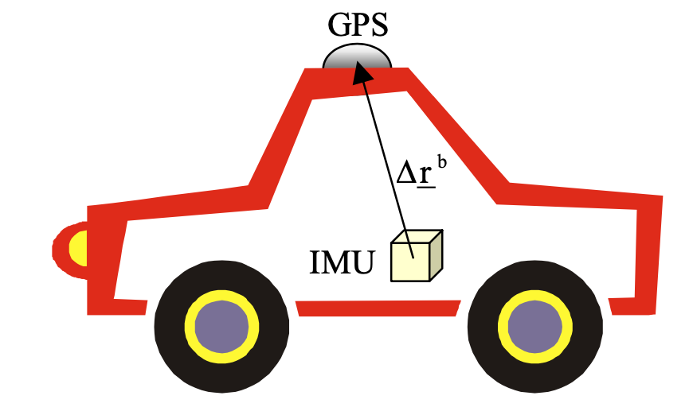
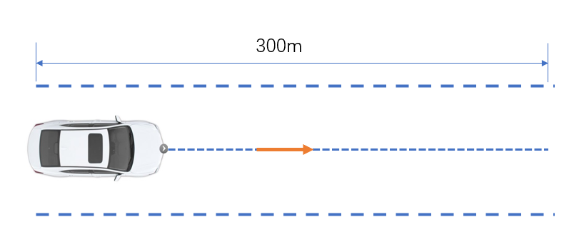

## Introduction

This is a project for imu heading angle calibration and evalution.

- **Imu heading calibration:** The imu heading angle is obtained by the registration calculation of GPS trajectory and imu data.

- **Imu heading evaluation:** Speed projection verification of imu through the calibrated heading angle of imu.

<br>

## Prerequisites

- Cmake
- eigen 3

## Compile

```shell
# mkdir build
mkdir -p build && cd build
# build
cmake .. && make
```

## Run
run command:
```shell
# run imu heading calibration
./bin/run_imu_heading method_id <data_dir>
```
- Set method_id = 1 if the vehicle is traveling in a straight line. 
- Set method_id = 2 if the vehicle is traveling freely.

## Note
It is recommended that the vehicle drives in a straight line for a better calibration result, as the picture shows below.
<br>
